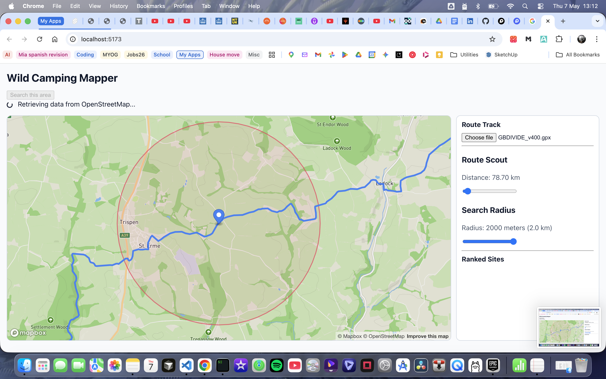
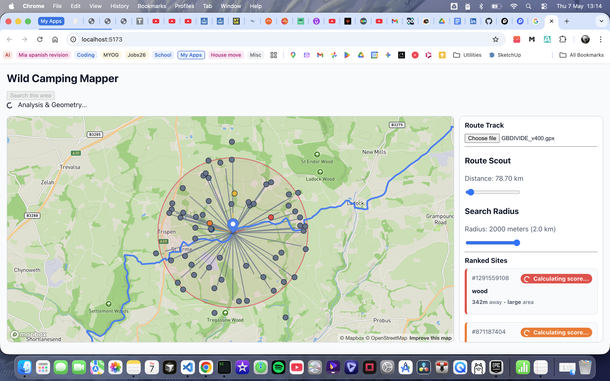
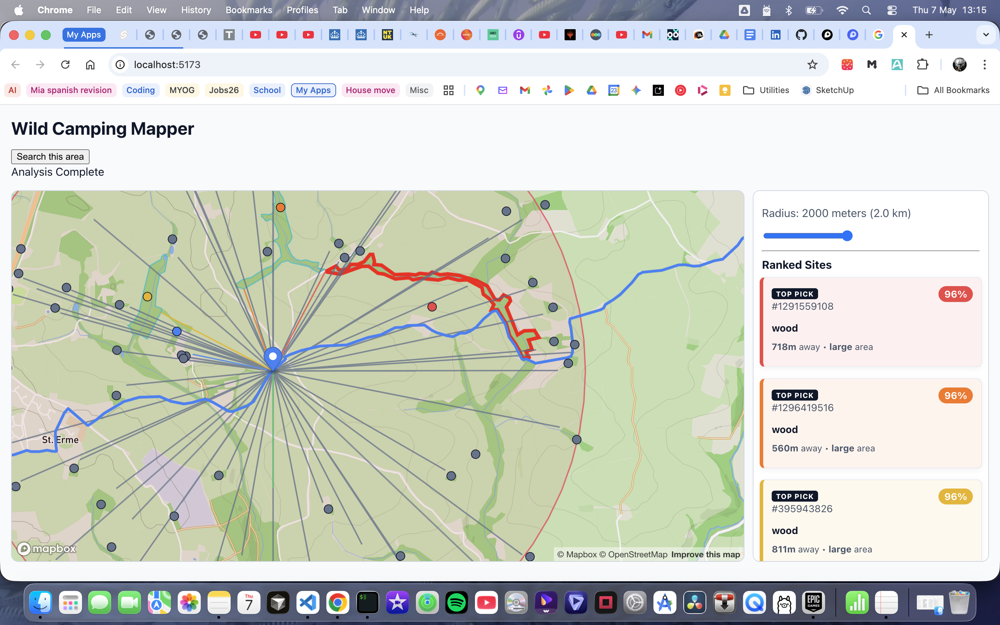

# This is an app that finds suitable camping spots along a route
Currently I am running the LLM locally using Ollama. 
This is run using the command 
```bash
ollama run safe-gemma --keepalive 30m
```

This profile uses the `gemma4:e2b` LLM with a context size of `8192`. This runs happily on my MacBook Air 8gb laptop!

## Mapbox API key
You will need a mapbox API key. Create a `.env` file in the main directory and add the 
`VITE_MAPBOX_TOKEN` key like this `VITE_MAPBOX_TOKEN=thisismykey`.
Register at mapbox then go to https://console.mapbox.com/account/access-tokens/ to create an access token.

## Running the Svelte front end
Remember to run `npm install` befire running the UI
```bash
npm run dev
```

## Running the backend

Install uv (macos)- `brew install uv`
Now sync the project using `uv synv`. This will synchronize the virtual environment with its dependencies, ensuring the environment exactly matches the uv.lock file. It installs, updates, or removes packages to reflect the lock file, creating a deterministic, identical environment for all users. It also builds the project itself and handles optional dependencies.

### Backend environment
Create a `server/.env` file with any keys you need for the LLM and Overpass usage, for example:

```bash
GEMINI_API_KEY=...
LOCAL_LLM_ENABLED=true
OLLAMA_BASE_URL=http://localhost:11434/v1
OLLAMA_API_KEY=ollama
OVERPASS_RETRY_MIN_DELAY_S=0.5
OVERPASS_RETRY_MAX_DELAY_S=1.5
```

### Run the server

```bash
cd server
uv run python server.py
```

## How to use
1. Load a GPX file. I have included the GB divide file here - /public/GBDIVIDE_v400.gpx
2. Use the slider the where you want to search i.e. the number of kilometres along the route
3. Optionally set the search radius. The default is 500m. Note: larger values will slow things down as the OS Maps API will returns a loit more data
4. Click 'Search this area'

This will get the data from OS StreetMap then return the road and water data from Overpass. Finally we will call the LLM for the best camping criteria before passing that into another LLM prompt to return the top 3 best sites for camping along the with OSM polygons.

The user can then click these to show where they are on the map!






