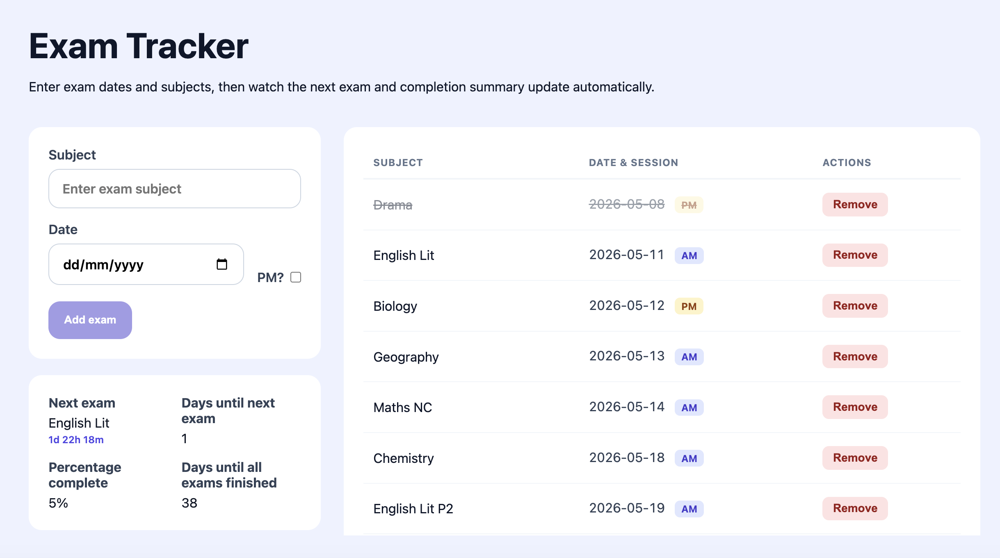

# Exam tracker app





I wrote this Svelte app for my daughter to track her GCSE exam progress.

## Features
1. Easily add an exam with title, date and time(am or pm)
2. Provides metrics such as percentage complete and days left.
3. Saves the exam list as a JSON object in the browser's local storage

## Installation

```bash
npm install
npm run dev
```

## Tests
To run the tests
```bash
npm run test
```

## Sample JSON
A sample exam list can be found [here](./public/exams.json). This is stored in local storage with the key `exams`.